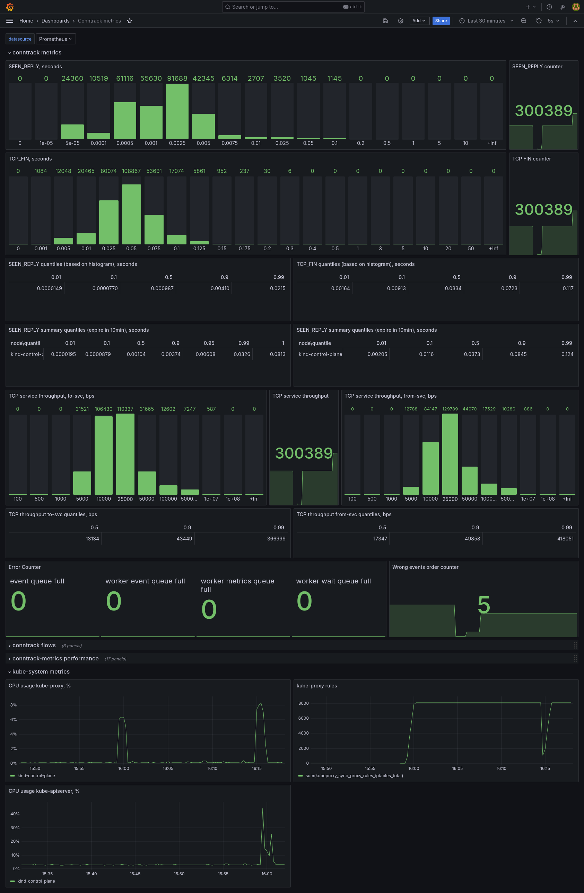

## Conntrack metrics for k8s services

This repository contains tools to get networking metrics from conntrack for k8s services.
It is based on go code that listens to conntrack events on every node and exposes metrics on a given port.

This repo has an example [monitoring.yaml](./monitoring.yaml) definition for monitoring namespace,
that creates and configures Prometheus to collect conntrack metrics and deploys grafana to display these
metrics.

[conntrack metrics daemonset](./conntrack-metrics.yaml) run conntrack-metrics pod on every node and exposes metrics.
It uses an image build with [Dockerfile](metrics_provider/Dockerfile).

Conntrack-tracking is inspired by https://github.com/ti-mo/conntrack and uses its netlink parsing logic,
thanks to [@ti-mo](https://github.com/ti-mo) for making it public.

All resources created by given yamls use `monitoring` namespace.

## Expose metrics

```shell
kubectl apply -f ./conntrack-metrics.yaml
```
If your service subnet is different from the default `10.96.0.0/16`, change `-svc-subnet=` parameter
in the [conntrack-metrics.yaml](./conntrack-metrics.yaml) file.

To see which metrics are exposed, `curl <node-ip>:9000/metrics`.

This DaemonSet tweaks the following flags on every node:
- `/proc/sys/net/netfilter/nf_conntrack_acct=1`
- `/proc/sys/net/netfilter/nf_conntrack_timestamp=1`

## Set up monitoring

```shell
kubectl apply -f ./monitoring.yaml
```

If you want to enable kube-proxy metrics, run

```shell
./enable-kube-proxy-metrics.sh
```

If you want to enable Calico metrics:

```shell
./enable-calico-metrics.sh
```

- prometheus GUI: `<node-ip>:30090`
- grafana GUI: `<node-ip>:30030`, login using admin/admin

### Create dashboard for conntrack metrics

Port forward to Grafana

```shell
while true; do kubectl port-forward -n monitoring svc/grafana 3000; done
```

- Log into grafana
- Left-side menu > Dashboards > Create Dashboard > Import Dashboard
  - Upload dashboard from [./dash.json](./dash.json)
  - Upload dashboard from [./felix-dash.json](./felix-dash.json)
  - Choose Prometheus as data source

The dashboard will reflect a connection after its conntrack flow is deleted, timeout for TCP is ~120 seconds,
therefore you may need to wait for 120 seconds to see the results.

## Run the workload

To see useful data, we need to create lots of svc connections, here is one way to do that (based on [@aojea](https://github.com/aojea)'s scripts).

1. Deploy the backends with the number of replicas we desire (we can always use kubectl later to scale up or down)

```
kubectl apply -f backend.yaml
```

2. Use the ClusterIP of the Service and do not depend on DNS since we just want to test the IP traffic

```
kubectl get service
NAME           TYPE        CLUSTER-IP         EXTERNAL-IP   PORT(S)   AGE
kubernetes     ClusterIP   10.96.0.1     <none>        443/TCP   4d3h
test-service   ClusterIP   10.96.0.23   <none>        80/TCP    13m
```

In this case is `10.96.0.23`

3. We can do manual tests by just running an httpd:2 container

```
kubectl run ab1 --image httpd:2
kubectl exec ab1 -- ab -c 1000 -n 50000 -v 1 http://$(kubectl get svc test-service -o jsonpath='{.spec.clusterIP}'):80/
This is ApacheBench, Version 2.3 <$Revision: 1903618 $>
Copyright 1996 Adam Twiss, Zeus Technology Ltd, http://www.zeustech.net/
Licensed to The Apache Software Foundation, http://www.apache.org/

Benchmarking 10.96.0.23 (be patient)
Completed 5000 requests
Completed 10000 requests
Completed 15000 requests
Finished 16021 requests
...
```

For more configurable workloads, see [./workload](./workload) directory.

## Check the results

After some connections to the service subnet are done (may take ~120 seconds for TCP connections to be reported via metrics)
you can check the results in the grafana dashboard. It should look something like this.


